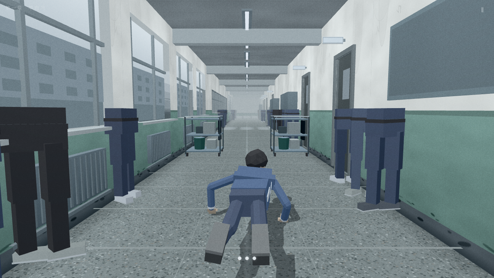
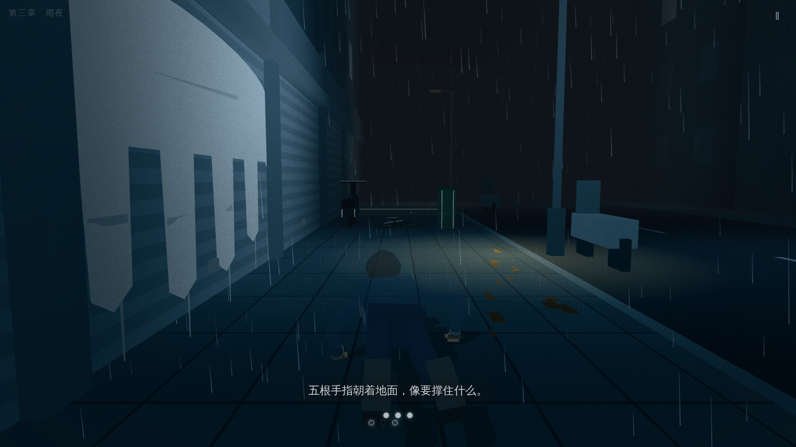
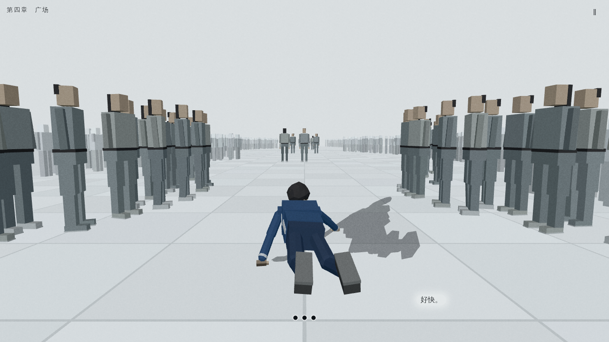
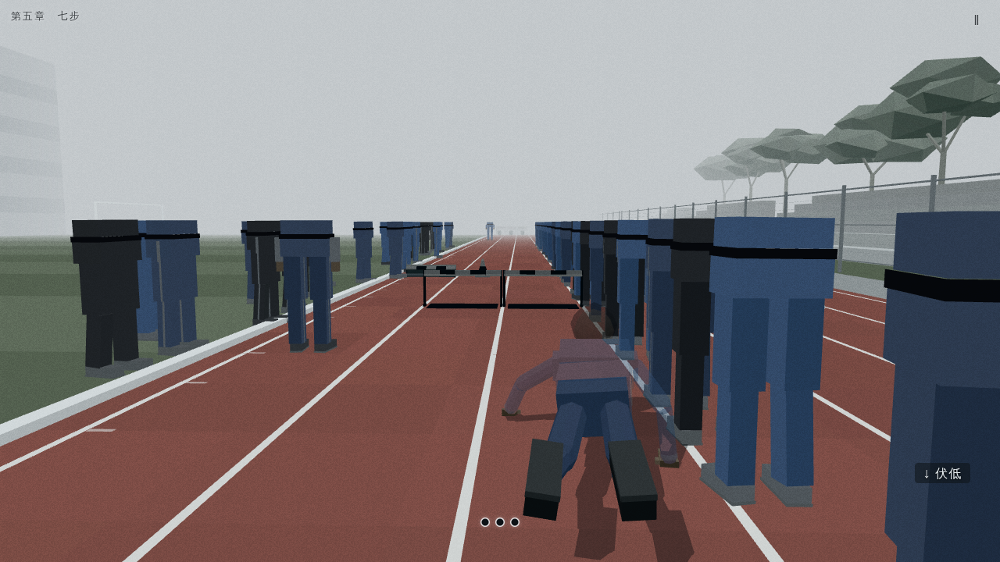

# 手行者 · 跑酷（Hand Walker Parkour）

基于[小说《手行者》](https://github.com/EveGoodEvening/hand-walker)改编的 three.js + WebGL 跑酷游戏。用双手穿过一所高中，五章约 15 分钟。

## 怎么玩

在线试玩：[手行者 · 跑酷](https://evegoodevening.github.io/hand-walker-parkour/)。

支持桌面和手机，建议戴耳机。

| 操作 | 键盘 | 触摸 |
|---|---|---|
| 换道 | ← → 或 A D | 左 / 右滑 |
| 撑跃 | ↑、W 或空格 | 上滑 |
| 伏低 / 压住抬起的腿 | ↓ 或 S（按住延长） | 下滑并按住 |
| 回头 / 让一下（出现提示时） | Q / E | 右下角按钮 |
| 暂停 | Esc 或 P | 右上角「‖」 |

稳度耗尽会摔倒，从检查点重来。

## 游戏截图

实机画面，点击可查看原图。

| 早自习 · 走廊 | 雨夜 · 街巷 |
| :---: | :---: |
| [](docs/screenshots/corridor.png) | [](docs/screenshots/rain-night.png) |

| 广场 · 梦中的人群 | 七步 · 体育课 |
| :---: | :---: |
| [](docs/screenshots/dream-plaza.png) | [](docs/screenshots/track.png) |

## 开发

需要 Node ≥ 24、npm 11。

```bash
npm ci
npm run dev      # 启动开发服务器
npm run build    # 构建单文件 HTML
```

构建后用浏览器打开 `dist/index.html`，无需外部资源，可离线游玩。

### 常用检查

| 命令 | 作用 |
|---|---|
| `npm run typecheck` | TypeScript 类型检查 |
| `npm test` | 单元测试 |
| `npm run validate` | 关卡与内容校验 |
| `npm run verify` | 全流程检查，含构建与浏览器冒烟测试 |

`npm run verify -- --skip-e2e` 跳过浏览器检查；`--full` 追加全章节与性能检查。浏览器检查使用本地 Chromium，可通过 `HW_CHROME` 指定路径。

## 第三方许可

游戏使用 three.js（`three@0.186.1`，MIT）。完整版权声明和许可文本见 [THIRD_PARTY_NOTICES.txt](THIRD_PARTY_NOTICES.txt)，也可从游戏标题页的「第三方许可」查看。

构建会将该文件内联到 `dist/index.html` 的非执行文本块 `#third-party-notices`，无需额外文件或网络请求。分发单文件 HTML 时请保留该文本块；升级运行时依赖或引入新库时，同步更新声明中的版本、版权和许可文本。

字体仅通过 CSS 和 Canvas 调用设备本地字体，不附带或下载字体文件。

## 文档

- [设计与技术规格](docs/DESIGN.md)
- [开发约定与经验](AGENTS.md)
- [完整命令与依赖](package.json)
